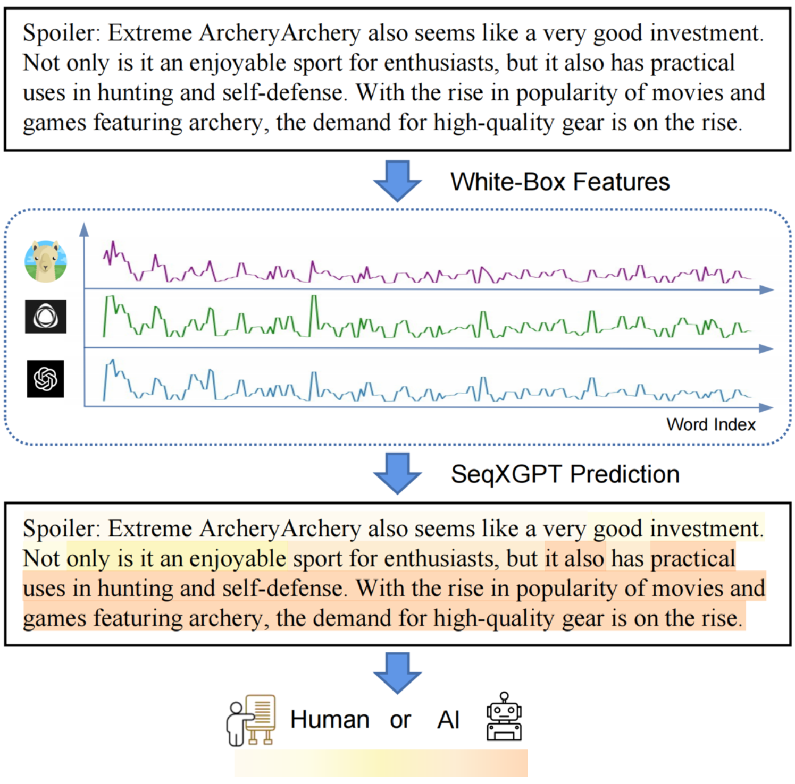
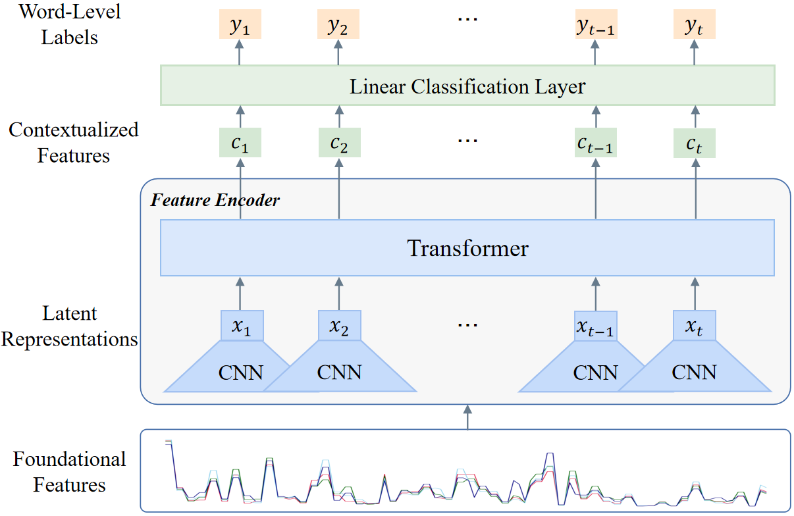

# SeqXGPT
<p align="center">
     <br>
</p>
<p align="center">
<a href='https://github.com/Jihuai-wpy/SeqXGPT/blob/main/LICENSE'>
</a> 
<a href='https://arxiv.org/abs/2310.08903'>
</a>
<a href='https://github.com/Jihuai-wpy/SeqXGPT/tree/main/SeqXGPT/dataset'>
</a>
</p>


This is the official repository for ["SeqXGPT: Sentence-Level AI-Generated Text Detection"](https://arxiv.org/abs/2310.08903).

## Introduction

Widely applied large language models (LLMs) can generate human-like content, raising concerns about the abuse of LLMs. Therefore, it is important to build strong AI-generated text (AIGT) detectors. Current works only consider document-level AIGT detection, therefore, we **first** introduce a sentence-level detection challenge by **synthesizing a dataset** that contains documents that are polished with LLMs, that is, the documents contain sentences written by humans and sentences modified by LLMs. Then we propose **Seq**uence **X** (Check) **GPT**, a novel method that utilizes log probability lists from white-box LLMs as features for sentence-level AIGT detection. These features are composed like *waves* in speech processing and cannot be studied by LLMs. Therefore, we build SeqXGPT based on convolution and self-attention networks. We test it in both sentence and document-level detection challenges. Experimental results show that previous methods struggle in solving sentence-level AIGT detection,  while **our method not only significantly surpasses baseline methods in both sentence and document-level detection challenges but also exhibits strong generalization capabilities**.


<p align="center">
     <br>
    <br>
    Process of Sentence-Level AIGT Detection Challenge.
</p>


## SeqXGPT

SeqXGPT is an advance method for sentence-level AI-generated text detection, which consists of the following three parts: 

1. Perplexity Extraction and Alignment;
2. Feature Encoder;
3. Linear Classification Layer.


<p align="center">
     <br>
    <br>
    SeqXGPT Framework.
</p>

Please refer to our [paper](https://arxiv.org/abs/2310.08903) for more details.

## Open-Source List

We list all the datasets, models, training and testing codes related to SeqXGPT [here](https://github.com/Jihuai-wpy/SeqXGPT/tree/main/SeqXGPT). 

## Performance

All the values listed in our table are **F1 scores**, and **Macro-F1 scores** to consider the overall performance. For detailed precision and recall scores, please refer to our [paper](https://arxiv.org/abs/2310.08903).

### Results of Particular-Model Binary AIGT Detection

SeqXGPT performs much better than two zero-shot methods and supervised method Sent-RoBERTa.

| Method           |  GPT-2   |  Human   | Macro-F1 | Method           | GPT-Neo  |  Human   | Macro-F1 |
| ---------------- | :------: | :------: | :------: | ---------------- | :------: | :------: | :------: |
| **$log$ $p(x)$** |   78.4   |   47.9   |   63.1   | **$log$ $p(x)$** |   73.9   |   41.2   |   57.5   |
| **DetectGPT**    |   65.8   |   42.9   |   54.3   | **DetectGPT**    |   57.6   |   41.3   |   49.4   |
| **Sent-RoBERTa** |   92.9   |   75.8   |   84.4   | **Sent-RoBERTa** |   92.6   |   73.4   |   83.0   |
| **SeqXGPT**      | **98.6** | **95.8** | **97.2** | **SeqXGPT**      | **98.8** | **96.4** | **97.6** |

| Method           |  GPT-J   |  Human   | Macro-F1 | Method           |  LLaMA   |  Human   | Macro-F1 |
| ---------------- | :------: | :------: | :------: | ---------------- | :------: | :------: | :------: |
| **$log$ $p(x)$** |   76.5   |   34.4   |   55.5   | **$log$ $p(x)$** |   69.1   |   27.1   |   48.1   |
| **DetectGPT**    |   66.8   |   37.0   |   51.9   | **DetectGPT**    |   52.8   |   47.6   |   50.2   |
| **Sent-RoBERTa** |   93.1   |   71.8   |   82.4   | **Sent-RoBERTa** |   89.7   |   69.6   |   79.6   |
| **SeqXGPT**      | **97.9** | **92.9** | **95.4** | **SeqXGPT**      | **96.0** | **89.9** | **92.9** |

### Results of Mixed-Model Binary AIGT Detection

SeqXGPT shows the best performance among these four methods. In contrast, the performance of Sniffer is noticeably inferior, which emphasizes that document-level AIGT detection methods cannot be effectively modified for sentence-level AIGT detection. Interestingly, we find that the performance of both RoBERTa-based methods is slightly inferior to SeqXGPT in overall performance. This suggests that the semantic features of RoBERTa might be helpful to discriminate human-created sentences.

| Method           |    AI    |  Human   | Macro-F1 |
| ---------------- | :------: | :------: | :------: |
| **Sniffer**      |   87.7   |   54.3   |   71.0   |
| **Sent-RoBERTa** | **97.6** |   92.6   |   95.1   |
| **Seq-RoBERTa**  |   97.4   |   91.8   |   94.6   |
| **SeqXGPT**      | **97.6** | **92.9** |   95.3   |

### Results of Mixed-Model Multiclass AIGC Detection

SeqXGPT can accurately discriminate sentences generated by various models and those authored by humans, demonstrating its strength in multi-class detection. It is noteworthy that RoBERTa-based methods perform significantly worse than binary AIGT detection.

| Method           |  GPT-2   | GPT-Neo  |  GPT-J   |  LLaMA   |  GPT-3   |  Human   | Macro-F1 |
| :--------------- | :------: | :------: | :------: | :------: | :------: | :------: | :------: |
| **Sniffer**      |   51.5   |   45.5   |   36.0   |   23.1   |   54.1   |   58.1   |   44.7   |
| **Sent-RoBERTa** |   43.1   |   31.6   |   31.5   |   42.4   |   78.2   |   90.5   |   52.9   |
| **Seq-RoBERTa**  |   55.5   |   36.7   |   32.0   |   78.6   | **94.4** |   92.3   |   64.9   |
| **SeqXGPT**      | **98.5** | **98.7** | **97.2** | **93.2** |   93.9   | **92.9** | **95.7** |

### Results of Document-Level AIGT Detection

sentence-level detection methods can be transformed and directly applied to document-level detection, and the performance is positively correlated with their performance on sentence-level detection. Overall, SeqXGPT exhibits excellent performance in document-level detection.

| Method           |  GPT-2   | GPT-Neo  |  GPT-J   |  LLaMA   |  GPT-3   |  Human   | Macro-F1 |
| :--------------- | :------: | :------: | :------: | :------: | :------: | :------: | :------: |
| **Sniffer**      |   85.4   |   84.5   |   74.6   |   13.0   |   81.3   |   66.2   |   67.5   |
| **Sent-RoBERTa** |   55.8   |   42.8   |   24.4   |   18.3   |   84.7   | **94.6** |   53.4   |
| **Seq-RoBERTa**  |   63.4   |   41.0   |   32.6   |   67.0   | **91.9** |   51.2   |   57.9   |
| **SeqXGPT**      | **99.5** | **99.5** | **98.0** | **93.3** |   90.4   |   84.8   | **94.2** |

### Results of Out-of-Distribution Sentence-Level AIGT Detection

The great performance of SeqXGPT on OOD data reflects the strong generalization capabilities of SeqXGPT.

| Method           |  GPT-2   | GPT-2-Neo |  GPT-J   |  LLaMA   |  GPT-3   |  Human   | Macro-F1 |
| ---------------- | :------: | :-------: | :------: | :------: | :------: | :------: | :------: |
| **Sniffer**      |   7.8    |   50.8    |   28.3   |   22.9   |   61.9   |   44.8   |   36.1   |
| **Sent-RoBERTa** |   32.5   |   18.2    |   24.8   |   30.8   |   74.6   |   30.5   |   35.2   |
| **Seq-RoBERTa**  |   53.7   |   29.0    |   29.9   |   75.2   |   92.3   |   83.6   |   60.6   |
| **SeqXGPT**      | **98.9** | **90.7**  | **95.2** | **90.3** | **93.7** | **88.2** | **92.8** |

## Contribution

In this paper, we first introduce the challenge of sentence-level AIGT detection and propose three tasks based on existing research in AIGT detection. Further, we introduce a strong approach, SeqXGPT, as well as a benchmark to solve this challenge. Through extensive experiments, our proposed SeqXGPT can obtain promising results in both sentence and document-level AIGT detection. On the OOD testset, SeqXGPT also exhibits strong generalization. We hope that SeqXGPT will inspire future research in AIGT detection, and may also provide insightful references for the detection of content generated by models in other fields.

## Limitations

Despite SeqXGPT exhibits excellent performance in both sentence and document-level AIGT detection challenge and exhibits strong generalization, it still present certain limitations:

1. We did not incorporate semantic features, which could potentially assist our model further in the sentence recognition process, particularly in cases involving human-like sentence generation. We leave this exploration for future work.
2. During the construction of GPT-3.5-turbo data, we did not extensively investigate the impact of more diversified instructions. Future research will dive into exploring the influence of instructions on AIGT detection.
3. Due to limitations imposed by the model's context length and generation patterns, our samples only consist of two distinct sources of sentences. In future studies, we aim to explore more complex scenarios where a document contains sentences from multiple sources.

## Acknowledgements

- We sincerely thank Qipeng Guo for his valuable discussions and insightful suggestions.
- This work was supported by the National Natural Science Foundation of China (No. 62236004 and No. 62022027).
- This work's logo was initially generated using OpenAI's [DALL-E 3](https://openai.com/research/dall-e-3-system-card) and further refined by Youqi Sun. Special thanks to both.

## Citation

If you find SeqXGPT useful for your research and applications, please cite using the Bibtex:

```
@misc{wang2023seqxgpt,
      title={SeqXGPT: Sentence-Level AI-Generated Text Detection}, 
      author={Pengyu Wang and Linyang Li and Ke Ren and Botian Jiang and Dong Zhang and Xipeng Qiu},
      year={2023},
      eprint={2310.08903},
      archivePrefix={arXiv},
      primaryClass={cs.CL}
}
```

